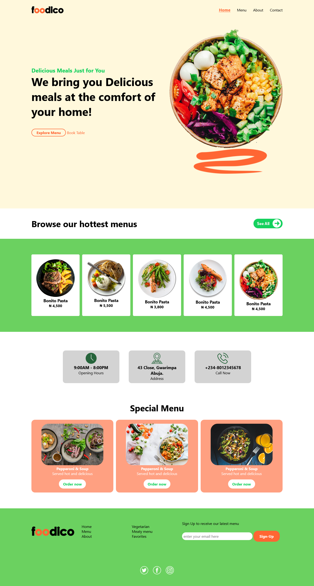

# Foodico Website

This is a website for a restaurant designed by me. 

## Table of contents
  - [The design](#the-design)
  - [Screenshot](#screenshot)
  - [Links](#links)
- [Author](#author)

### The design

The following tools were utilized for the design:

- HTML 
- CSS
- AOS library

### Screenshot

### Links

- Live Site URL: [Foodico](https://maureenmoguche.github.io/foodico)

## Author

- Website - [Maureen Oguche](https://github.com/MaureenMOguche)
- Frontend Mentor - [@MaureenMOguche](https://www.frontendmentor.io/profile/MaureenMOguche)
- Twitter - [@MaureenOguche](https://www.twitter.com/MaureenOguche)
